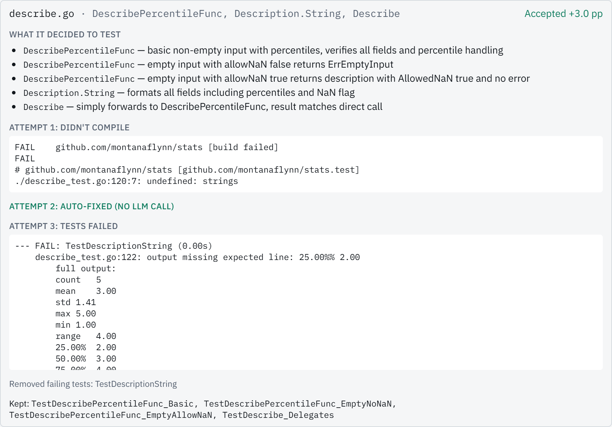

# go-coverage-agent

[](https://github.com/LionelRoxas/go-coverage-agent/actions/workflows/ci.yml)

An autonomous agent that raises unit-test coverage for Go repositories. Give it a local Go module and a target
percentage. It measures coverage, plans what to test, asks an LLM to write idiomatic Go tests, compiles and runs
them, keeps only the tests that pass and add coverage, and repeats until it hits the target or gains flatten out.

<a href="docs/screenshots/gallery-summary.png"></a>

## Quick start

Requirements: Docker Desktop with Compose v2.24+, and a Groq API key from https://console.groq.com/keys.
Node 22+ is only needed to run the frontend tests outside Docker.

```bash
git clone https://github.com/LionelRoxas/go-coverage-agent.git && cd go-coverage-agent
cp .env.example .env          # then paste your key into GROQ_API_KEY
docker compose up --build
```

Open http://localhost:3000 (or `http://localhost:${FRONTEND_PORT}` if you changed it), click
**Use sample repo (montanaflynn/stats)**, then **Start**. The target defaults to 80%.

**Model:** `openai/gpt-oss-120b` on Groq (fallback: `openai/gpt-oss-20b`, set `GROQ_MODEL` in `.env`). The model name is also
reported by `GET /api/health` and shown in the UI.

If `.env` is missing or has no key, the stack still starts and the UI shows a "No Groq API key configured" banner.

**Ports.** Set `BACKEND_PORT` / `FRONTEND_PORT` in `.env` (defaults 8000 / 3000) if those are taken. Changing them requires
`docker compose up --build`, because the frontend bakes the API URL at build time.

**Linux note.** The backend runs as uid 1000. On Linux hosts with a different uid, make `./repos` and `./output` writable by uid 1000.

### What to expect

- On a Groq **Developer plan** (observed limit: 250K tokens/min) a run on `stats` to 80% took about **5 minutes**
  (287 s, 184,926 tokens) with no rate-limit waits.
- On a **free-trial key** (8K tokens/min, 200K tokens/day), set `DAILY_TOKEN_BUDGET=190000` in `.env`. Expect long waits
  (the UI shows "waiting for rate limit"; that's normal) and possibly stopping short of 80%. An earlier run on such a key reached
  69.0% in about 28 minutes, mostly waiting on rate limits, before the then-default 10-iteration cap. Plan on one full run per key per day.
- Accepted tests are always saved, even if a run stops early.

## Using your own repository

Put the Go module under `./repos/<name>` (or set `HOST_REPOS_DIR` in `.env` to an **absolute** path whose subfolders are Go modules,
e.g. `/Users/you/code`; compose does not expand `~`), restart, and pick it in the UI. Your repository is never modified: the agent
works on a copy, and the generated tests are written to `./output/<job-id>/tests/`.

## How it works

```
┌──────────────────────────── docker compose ────────────────────────────┐
│  ┌──────────────┐   HTTP + SSE    ┌──────────────────────────────────┐ │
│  │  frontend    │ ──────────────▶ │  backend (FastAPI)               │ │
│  │  Next.js     │ 127.0.0.1:8000  │  API ─▶ JobManager ─▶ Orchestrator │
│  │  :3000       │                 │      Planner    Writer/Fixer  Validator
│  └──────────────┘                 │   (deterministic)  (LLM)     (go tools)
│                                   │               LLM client   gohelper│
│                                   │                  Groq API   go test/vet/gofmt
│                                   │   Workspace: /work/<job>/repo (copy)│
│                                   └──────────────────────────────────┘ │
│  volumes: ${HOST_REPOS_DIR:-./repos} ─▶ /repos   ./output ─▶ /output    │
└────────────────────────────────────────────────────────────────────────┘
```

The loop is plain, testable Python. The LLM only writes and fixes tests.

1. **Measure.** Copy the repo, delete existing `_test.go` files (default), and measure baseline coverage per package with `go test -coverprofile`.
2. **Plan.** A deterministic planner ranks files by uncovered statements and picks up to 3 targets per iteration (no planning tokens).
3. **Write.** The Writer LLM gets a compact context (the functions to test, with lines marked `// UNCOVERED`) and returns new test functions as schema-constrained JSON.
4. **Merge and validate.** A Go AST helper appends the tests to `<source>_test.go`. The candidate must pass the import guard, `go vet`, and `go test -count=2`, and the set of covered blocks must be a strict superset of the previous one.
5. **Repair.** Failing assertions are pruned test by test; forgotten imports and unqualified identifiers are fixed mechanically; anything else goes to the Fixer LLM (up to 2 attempts). Rejected candidates are rolled back.
6. **Stop** on target reached, marginal gains (less than `min_gain` points for `patience` iterations), max iterations, no remaining targets, token budget, or cancel. Artifacts are always written.

## Results on montanaflynn/stats

Developer-plan key, 2026-10-08, defaults (20 iterations max, 3 targets per iteration), target 80%.

| Target | Final coverage | Tests added | Duration | Tokens | Stop reason |
|---|---|---|---|---|---|
| 80% | 0.0% → 80.51% (1247 statements) | 34 test files; 41 candidates accepted, 4 rejected | 287 s (15 iterations) | 184,926 | `target_reached` |

45 LLM calls (41 writer, 4 fixer), 7 mechanical repairs, 0 rate-limit waits.

Independent check: the generated tests were copied into a fresh clone with all `_test.go` removed; `go vet` was clean, `go test` passed, and
coverage was **80.5%**.

An earlier run on a free-trial key (8K tokens/min, 200K/day) reached 69.0% in about 28 minutes before hitting the then-default 10-iteration cap,
mostly waiting on rate limits.

## Screenshots

<table>
<tr>
<td valign="top">
<a href="docs/screenshots/gallery-setup.png"></a>
<br><b>Setup page</b><br>The repository (<code>stats</code>) is selected, the target is 80%, and the notices state that existing tests are removed from a working copy, source is sent to Groq, and how many tokens remain today.
</td>
<td valign="top">
<a href="docs/screenshots/gallery-summary.png"></a>
<br><b>Run summary</b><br>Header, coverage meter with the 80% target marker, and the summary card: stop reason, coverage 0.0% to 80.5%, 135 tests added in 34 test files, 4m 47s, 184.9k tokens.
</td>
</tr>
<tr>
<td valign="top">
<a href="docs/screenshots/gallery-chart.png"></a>
<br><b>Coverage by iteration</b><br>Coverage after each of the 15 iterations, rising steadily from the 0% baseline and crossing the dashed 80% target line at the end.
</td>
<td valign="top">
<a href="docs/screenshots/gallery-timeline.png"></a>
<br><b>Timeline item, expanded</b><br>One file's work in iteration 7: what the model decided to test, a compile failure (<code>undefined: strings</code>), a mechanical auto-fix with no LLM call, a failing test that is pruned, and the rest kept (Accepted +3.0 pp).
</td>
</tr>
<tr>
<td valign="top">
<a href="docs/screenshots/gallery-testfile.png"></a>
<br><b>Generated tests</b><br>Every accepted test file is browsable with syntax-highlighted Go, here <code>clip_test.go</code>, so the output can be reviewed before use.
</td>
<td valign="top">
<a href="docs/screenshots/gallery-live.png"></a>
<br><b>Cancelled run</b><br>A real run that was cancelled early: 8.6% coverage, 8 tests in 2 files, and the message that accepted tests were kept.
</td>
</tr>
<tr>
<td valign="top">
<a href="docs/screenshots/gallery-dark.png"></a>
<br><b>Dark theme</b><br>The same summary and chart under a dark color scheme; the layout and target marker are unchanged.
</td>
<td valign="top">
<a href="docs/screenshots/gallery-mobile.png"></a>
<br><b>Mobile</b><br>The results page at 390 px wide: header, meter and summary reflow to fit a phone-width screen.
</td>
</tr>
</table>

Full-page captures: [setup (light)](docs/screenshots/setup-light.png), [setup (dark)](docs/screenshots/setup-dark.png), [setup (mobile)](docs/screenshots/setup-mobile.png), [results (light)](docs/screenshots/results-light.png), [results (dark)](docs/screenshots/results-dark.png), [results (mobile)](docs/screenshots/results-mobile.png), [live run](docs/screenshots/live-run.png).

## Configuration

Options (`POST /api/jobs`). The UI's "Advanced" section exposes max iterations, min gain, files per iteration (`targets_per_iteration`) and fix attempts; the rest (`patience`, `delete_existing_tests`, `max_llm_tokens`, `exclude_patterns`) are API-only:

| Option | Default | Range |
|---|---|---|
| `target_coverage` | 80 | 1-100 |
| `max_iterations` | 20 | 1-30 |
| `min_gain` (percentage points per iteration) | 1.0 | 0-10 |
| `patience` | 2 | 1-5 |
| `targets_per_iteration` | 3 | 1-5 |
| `max_fix_attempts` | 2 | 0-4 |
| `delete_existing_tests` | true | bool |
| `max_llm_tokens` (per job) | 1,000,000 | 10K-2M |
| `exclude_patterns` (module-relative globs) | `["examples/**", "testdata/**"]` | list |

Environment variables (`.env`, see `.env.example`):

| Variable | Default | Meaning |
|---|---|---|
| `GROQ_API_KEY` | (empty) | Required to start a job |
| `GROQ_MODEL` | `openai/gpt-oss-120b` | Fallback: `openai/gpt-oss-20b` |
| `GROQ_REASONING_EFFORT` | `low` | `low`, `medium` or `high` |
| `GROQ_MAX_COMPLETION_TOKENS` | unset | Optional cap on output tokens (unset = model maximum) |
| `CALL_TOKEN_RESERVATION` | 8000 | Tokens reserved per call for rate pacing; lower means more calls/min |
| `DAILY_TOKEN_BUDGET` | 2,000,000 | Set `190000` on free-trial keys |
| `BACKEND_PORT` / `FRONTEND_PORT` | 8000 / 3000 | Host ports (loopback only); rebuild after changing |
| `HOST_REPOS_DIR` | `./repos` | Absolute host path whose subfolders are Go modules |

## Running the tests

```bash
make test               # everything: Go helper, backend unit + integration (in Docker), frontend
make test-go
make test-backend
make test-integration
make test-frontend
```

Without `make` (Windows / Git Bash). Go is not required on the host; it runs in Docker:

```bash
export MSYS_NO_PATHCONV=1
# Go helper
docker run --rm -v "$PWD/tools/gohelper:/src" -w /src golang:1.27-bookworm go test ./...
# Backend image, then unit and integration tests inside it
docker build -f backend/Dockerfile --build-arg GO_IMAGE=golang:1.27-bookworm -t gca-backend .
docker run --rm gca-backend uv run --no-sync pytest
docker run --rm gca-backend uv run --no-sync pytest -m integration
# Frontend
cd frontend && npm ci && npm test
```

## Design decisions and trade-offs

- **Deterministic loop, LLM only for writing and fixing tests** (structured JSON output, no tool calls). Why: reliability, token cost, testability, safety. The LLM never gets a shell.
- **Append-only test generation** through a small Go AST helper. Accepted tests can't be lost, and failing tests are pruned one by one.
- **Strict acceptance:** a candidate is kept only if vet is clean, tests pass twice, and covered blocks strictly grow. Coverage never regresses.
- **The container is the sandbox:** non-root, env allowlist (the API key is not passed to test processes, although code running as the same container user could still read it via `/proc`), import allowlist, timeouts with process-group kill, loopback-only ports. No Docker socket mount, because that would give the backend root-equivalent access to the host.
- **Token economy over generality:** a measured run showed that most Fixer calls were for mechanical errors (forgotten imports), so those are repaired without an LLM call, and the planner packs as many statements as fit into one prompt. See spec §6.7.
- **Groq only:** fast iterations; the cost is that reviewers need a key and rate limits shape run time on free keys. Output tokens are left uncapped by default (suited to a paid key).

## Limitations

- Expected values for floating-point code are partly characterization tests: when a generated assertion fails, the fixer may adopt the observed value if it's plausible. Real bugs may therefore be encoded rather than flagged; review generated assertions before trusting them.
- Generated tests run inside the backend container and could read files there (including the backend's environment via `/proc`) and start processes. The guard rejects `StartProcess` and `/proc/` references, but that is a speed bump, not a sandbox. The production fix is a per-job sandbox with a separate uid (gVisor/Firecracker, no network).
- The repository's source code is sent to Groq.
- Jobs are in memory. Restarting the backend forgets the job list, but `./output` keeps all artifacts.
- Results depend on Groq rate limits and on the model; run time and final coverage vary between runs.

## AI usage

I used Claude Code as a pair programmer and implementation team. I set the direction and made the product and architecture decisions; Claude turned them into a detailed spec and plan and wrote the code. The assessment asks where AI was and wasn't used, so here is the split.

### What I decided before any detailed plan existed

- **Architecture.** Separate agents with a client/server split: a Next.js frontend and a FastAPI backend, run with Docker Compose. I chose FastAPI for the server side with production deployment in mind (run locally first, deploy to the cloud later).
- **LLM provider and model.** Groq, with `openai/gpt-oss-120b`.
- **The core idea.** An agent that plans, writes and executes unit tests and uses the execution results to decide what to do next. My first version gave the model terminal access; together we refined that into fixed, whitelisted Go commands and schema-checked JSON, so the model never gets a shell.
- **The process.** Spec first, then a task-by-task implementation plan, each reviewed repeatedly until the gaps were closed, then execution with an independent review of every task.

### Decisions I made during the build

- **Uncapped model output.** When Groq returned malformed JSON, I identified the output cap as the likely cause and had it removed.
- **The right API key.** I found that my first key was a free trial (8K tokens/min, 200K tokens/day), checked Groq's documentation, and switched to a Developer-plan key. That took the full run from a 28-minute partial result (69%) to 80.5% in under five minutes.
- **Token efficiency.** I chose to cut tokens per iteration, rather than adding a "continue a previous run" feature or relying on higher rate limits, so the tool stays usable on rate-limited keys. The data-driven changes that followed (a no-LLM repair step, larger targets per call) cut tokens per covered point by about 13%.
- **Publishing and disclosure.** The wording of the per-file disclosure line and the pull-request workflow.

### What Claude did

- Proposed options and trade-offs at each decision point, and drafted the design spec and implementation plan from my direction. Each was reviewed by a separate AI reviewer and revised before I approved it.
- Wrote the code through subagents, one task at a time. A separate AI reviewer checked every task against the spec, with fix rounds until it passed.
- Ran the test suites and the live runs I approved, using the Groq keys I supplied. The numbers in [Results](#results-on-montanaflynnstats) come from those runs.

### What that means for the code

The code is AI-generated. I didn't hand-write it or review it line by line; I own the design, the decisions above, and the verified results. Every source file starts with a one-line comment saying how it was produced, and the full trail (spec, plan, measured runs) is in [`docs/superpowers/`](docs/superpowers/).
