# go-coverage-agent

[](https://github.com/LionelRoxas/go-coverage-agent/actions/workflows/ci.yml)

An autonomous agent that raises unit-test coverage for Go repositories. Give it a local Go module and a target
percentage. It measures coverage, plans what to test, asks an LLM to write idiomatic Go tests, compiles and runs
them, keeps only the tests that pass and add coverage, and repeats until it hits the target or gains flatten out.

<a href="docs/screenshots/gallery-summary.png">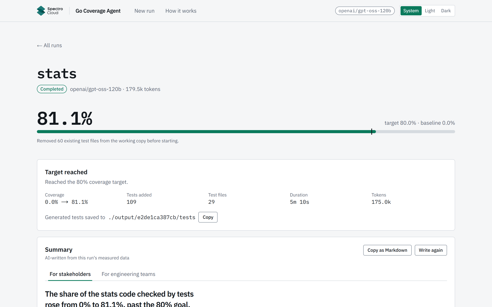</a>

## Quick start

Requirements: Docker Desktop with Compose v2.24+, and a Groq API key from https://console.groq.com/keys.
Node 22+ is only needed to run the frontend tests outside Docker.

```bash
git clone https://github.com/LionelRoxas/go-coverage-agent.git && cd go-coverage-agent
cp .env.example .env          # then paste your key into GROQ_API_KEY
docker compose up --build
```

Open http://localhost:3000 (or `http://localhost:${FRONTEND_PORT}` if you changed it), click the
**montanaflynn/stats** card under **Sample repos**, then **Start**. The target defaults to 80%.
The New run page walks you through four numbered steps: choose a repository, set a target, optional advanced options, start the run.

**Model:** `openai/gpt-oss-120b` on Groq (fallback: `openai/gpt-oss-20b`, set `GROQ_MODEL` in `.env`). The model name is also
reported by `GET /api/health` and shown in the UI.

If `.env` is missing or has no key, the stack still starts and the UI shows a "No Groq API key configured" banner.

**Ports.** Set `BACKEND_PORT` / `FRONTEND_PORT` in `.env` (defaults 8000 / 3000) if those are taken. Changing them requires
`docker compose up --build`, because the frontend bakes the API URL at build time.

**Linux note.** The backend runs as uid 1000. On Linux hosts with a different uid, make `./repos` and `./output` writable by uid 1000.

### What to expect

- On a Groq **Developer plan** (observed limit: 250K tokens/min) a run on `stats` to 80% took about **5 minutes**
  (287 s, 184,926 tokens) with no rate-limit waits.
- On a **free-trial key** (8K tokens/min, 200K tokens/day), set `DAILY_TOKEN_BUDGET=190000`, `MAX_PROMPT_TOKENS=4500` and `CALL_TOKEN_RESERVATION=8000` in `.env`. The client reads the key's tokens-per-minute limit from Groq's response headers and automatically lowers `max_completion_tokens` to fit (a rejected request is retried once with the clamped value); Developer keys keep 65536. To force a smaller value, set `GROQ_MAX_COMPLETION_TOKENS` (e.g. `4000`). Expect long waits
  (the UI shows "waiting for rate limit"; that's normal) and possibly stopping short of 80%. An earlier run on such a key reached
  69.0% in about 28 minutes, mostly waiting on rate limits, before the then-default 10-iteration cap. Plan on one full run per key per day.
- Accepted tests are always saved, even if a run stops early.

## Using your own repository

Step 1 of the setup page, **Choose a repository**, has two tabs.

**Sample repos** lists six small, dependency-free Go libraries. Click one and it is downloaded into `./repos/<id>` (shallow clone of a pinned release tag, no submodules; stats: default branch, the assessment's evaluation repo), then selected. Nothing else is fetched.

| Sample | What it is | Licence |
|---|---|---|
| `montanaflynn/stats` | Statistics functions | MIT |
| `Masterminds/semver` | Semantic version parsing and constraints | MIT |
| `huandu/xstrings` | String utilities | MIT |
| `dustin/go-humanize` | Human-friendly numbers, sizes and times | MIT |
| `google/btree` | In-memory B-tree (generics) | Apache-2.0 |
| `shopspring/decimal` | Arbitrary-precision decimals | MIT |

**Your folders** lists every Go module (a folder with a `go.mod`, up to two levels deep) in the mounted folder, apart from the samples. To add your own, either:

1. Copy or clone it into the mounted folder (`./repos` by default; the tab shows the real host path), then press Refresh; or
2. Set `HOST_REPOS_DIR` in `.env` to any parent folder and run `make up` again. Compose needs an absolute path (it does not expand `~`) or one relative to this repository:

   | OS | Example |
   |---|---|
   | Windows | `HOST_REPOS_DIR=C:\Users\you\code` |
   | macOS | `HOST_REPOS_DIR=/Users/you/code` |
   | Linux | `HOST_REPOS_DIR=/home/you/code` |

Your repository is never modified: the agent works on a copy, and the generated tests are written to `./output/<job-id>/tests/`.

## How it works

```
┌──────────────────────────── docker compose ────────────────────────────┐
│  ┌──────────────┐   HTTP + SSE    ┌──────────────────────────────────┐ │
│  │  frontend    │ ──────────────▶ │  backend (FastAPI)               │ │
│  │  Next.js     │ 127.0.0.1:8000  │  API ─▶ JobManager ─▶ Orchestrator │
│  │  :3000       │                 │      Planner    Writer/Fixer  Validator
│  └──────────────┘                 │   (deterministic)  (LLM)     (go tools)
│                                   │               LLM client   gohelper│
│                                   │                  Groq API   go test/vet/gofmt
│                                   │   Workspace: /work/<job>/repo (copy)│
│                                   └──────────────────────────────────┘ │
│  volumes: ${HOST_REPOS_DIR:-./repos} ─▶ /repos   ./output ─▶ /output    │
└────────────────────────────────────────────────────────────────────────┘
```

The loop is plain, testable Python. The LLM only writes and fixes tests. The app explains the same loop in plain language at `/how-it-works` (each step has a collapsed Technical detail with the precise version), and the full walkthrough is linked from there.

1. **Measure.** Copy the repo, delete existing `_test.go` files (default), and measure baseline coverage per package with `go test -coverprofile`.
2. **Plan.** A deterministic planner ranks files by uncovered statements and picks up to 3 targets per iteration (no planning tokens).
3. **Write.** The Writer LLM gets a compact context (the functions to test, with lines marked `// UNCOVERED`) and returns new test functions as schema-constrained JSON.
4. **Merge and validate.** A Go AST helper appends the tests to `<source>_test.go`. The candidate must pass the import guard, `go vet`, and `go test -count=2`, and the set of covered blocks must be a strict superset of the previous one.
5. **Repair.** Failing assertions are pruned test by test; stray quotes or backslashes around import paths, forgotten imports, unqualified identifiers and reused test names are fixed mechanically; anything else goes to the Fixer LLM (up to 2 attempts). Rejected candidates are rolled back.
6. **Stop** on target reached, marginal gains (less than `min_gain` points for `patience` iterations), max iterations, no remaining targets, token budget, or cancel. Artifacts are always written.

**The UI.** The setup page has a **Runs** panel: a live card for a running job (with Cancel) and past runs with before to after coverage. The job page has an "← All runs" link. The header has a System / Light / Dark toggle (remembered per browser) and a **How it works** page. The Spectro Cloud logo in the navbar is there because this is a take-home for Spectro Cloud; it is not a Spectro Cloud product.

## Results on montanaflynn/stats

Developer-plan key, 2026-10-08, defaults (20 iterations max, 3 targets per iteration), target 80%.

| Target | Final coverage | Tests added | Duration | Tokens | Stop reason |
|---|---|---|---|---|---|
| 80% | 0.0% → 80.51% (1247 statements) | 34 test files; 41 candidates accepted, 4 rejected | 287 s (15 iterations) | 184,926 | `target_reached` |
| 80% (newest run, after the fixes below) | 0.0% → 80.75% | 30 test files; 34 candidates accepted, 1 rejected | 248 s (12 iterations) | 182,494 | `target_reached` |

The 80.51% run (`89eb53b5907e`): 45 LLM calls (41 writer, 4 fixer), 7 mechanical repairs, 0 rate-limit waits.

The newest run (`26598ee5c57b`): 42 LLM calls (35 writer, 7 fixer), 5 mechanical repairs, 0 model errors, 0 rate-limit waits.

Independent check: the generated tests were copied into a fresh clone with all `_test.go` removed; `go vet` was clean, `go test` passed, and
coverage was **80.5%**. The same check on run `ca1beb9a1fdb` (80.11%) also passed, with 80.1%.

An earlier run on a free-trial key (8K tokens/min, 200K/day) reached 69.0% in about 28 minutes before hitting the then-default 10-iteration cap,
mostly waiting on rate limits.

## Results on Masterminds/semver

Developer-plan key, 2026-10-09, target 80%, defaults. Writer at `medium` reasoning in both new runs; the Fixer's effort was the variable.

| Run | Setup | Coverage | Iterations / time | Items accepted / rejected | Tokens |
|---|---|---|---|---|---|
| `acab3e3c7570` | before the prompt-budget and duplicate-name fixes | 1.4% → 64.2%, stopped on small gains | 8 / 129 s | — | 115.9K |
| `f9f3edcd9bfc` | after those fixes, `low` effort | 1.4% → 80.1%, target reached | 4 / 75 s | — | 59.0K |
| `736baa413b5d` | after the Fixer-history fixes, Fixer `medium` | 1.4% → **84.6%**, target reached | 4 / 114 s | 8 / 0 | 82.6K |
| `d247037efdb2` | same, Fixer `low` | 1.4% → **84.4%**, target reached | 3 / 88 s | 7 / 0 | 69.2K |

Each of the last two runs needed only one LLM fix, and both fixes were accepted (12.8 s at `medium`, 9.6 s at `low`), so the two runs are too close to rank the Fixer's effort. A Fixer call at `high` was still waiting after about 114 s, which is why both roles default to `medium`.

## Issues I found in testing and fixed

I ran the system end to end, spotted these problems, and decided the fixes. Claude Code implemented them under review.

| Symptom | Root cause | Fix | Evidence |
|---|---|---|---|
| Malformed-JSON errors from Groq (400 `json_validate_failed`) | The output cap (7K minus the prompt) left too little room after hidden reasoning tokens | Removed the artificial cap; `max_completion_tokens` is the model maximum (65536), clamped to the key's per-minute token limit, with one retry on a size rejection | No JSON errors in later runs (see the next rows) |
| A run took about 28 minutes and stopped at 69% | The key was a free-trial key (8K tokens/min, 200K tokens/day), so the agent was pacing to the limits | Switched to a Developer-plan key; documented free-tier settings (`DAILY_TOKEN_BUDGET=190000`) in `.env.example` | Run `a46c5a902f70`: 1678 s, 68.97%, 46 rate-limit events. Run `89eb53b5907e`: 287 s, 80.51% |
| "max completion tokens" / JSON errors, and `norm.go` stuck at 32.7% | Plan items with 12 to 37 functions asked the model for answers too large to finish | The planner caps a plan item at 5 functions / 100 statements (lowered from 8; see Design decisions); an over-size answer splits the item in half and retries | Run `ca1beb9a1fdb` to `26598ee5c57b`: 4 model errors to 0, `norm.go` 32.74% to 90.27%, 80.75% overall |
| I worried that failing tests were counted toward coverage | Not a bug. A candidate is accepted only if `go test -count=2` passes and coverage is a strict superset; rejected candidates are rolled back | Verified, no change | Final tests of run `ca1beb9a1fdb` re-run in a fresh clone: all pass, 80.1% |
| `make test` failed in PowerShell | The Makefile used `cat` and `VAR=x cmd`, which `cmd.exe` lacks | Shell-independent Makefile (`$(file <.go-version)`, exported `MSYS_NO_PATHCONV`) with a fallback for macOS make 3.81 | `make test` passes in PowerShell, Git Bash and CI |
| No way to switch light/dark, no way back to the start page, the running job was only a one-line banner, the navbar looked unfinished, and the app did not explain the loop | UI gaps | System / Light / Dark toggle in the header (remembered per browser), "← All runs" on the job page, a Run history panel on the setup page (live running card with Cancel, past runs with before to after coverage), a redesigned navbar and a How it works page | Screenshots below |
| semver run stalled at 64.2%: fix attempts failed with 'targets need ~3591 tokens; budget is 2191' and duplicate test names | prompt cap from the free-trial era left the fixer too little room; existing test names were crowded out of the prompt | `MAX_PROMPT_TOKENS` default 4,500 → 12,000 (free-trial keys set 4,500); existing test names now come before optional context; Fixer prompts shrink (first error lines, then only the whole declarations the errors point at, then no code) instead of failing; a reused `Test…` name is renamed to `_2`, `_3`, … without an LLM call; an oversized prompt shows as "Prompt too large (no model call)", not "Model error" | Run `acab3e3c7570`: 1.4% → 64.2% in 8 iterations, stopped on small gains. Re-run `f9f3edcd9bfc`: 1.4% → 80.1% in 4 iterations, 75 s, 59K tokens, target reached, 0 model or prompt-size errors; 3 duplicate names renamed without an LLM call |
| LLM fixes kept repeating a wrong assertion (semver constraints.go rejected after 6 attempts). I traced that item through the event log and questioned why the LLM kept failing | the fixer only saw the latest check result; after failing tests were removed it saw 'no new coverage' and never the observed values; reasoning effort was at its minimum | I decided to prioritise LLM quality. The Fixer now gets the candidate's full attempt history (each check's source, kind, failed tests and the failing assertions with their observed values), kept within the prompt budget; after pruning leaves no new coverage it is told to keep the failing tests and correct their values; the Fixer prompt says to trust the observed value; the Writer prompt says to trace the code path before asserting; reasoning effort per role (both default to `medium`: a `high` Fixer call was measured as too slow, still waiting after ~114 s against 9 s for a `medium` Writer call in job `86b6d88b558c`) | Same semver target afterwards: 1.4% → 84.6% in 4 iterations and 114 s, 8 items accepted, 0 rejected, 82.6K tokens (job `736baa413b5d`). See [Results on Masterminds/semver](#results-on-mastermindssemver) |

## Screenshots

<table>
<tr>
<td valign="top">
<a href="docs/screenshots/gallery-setup.png">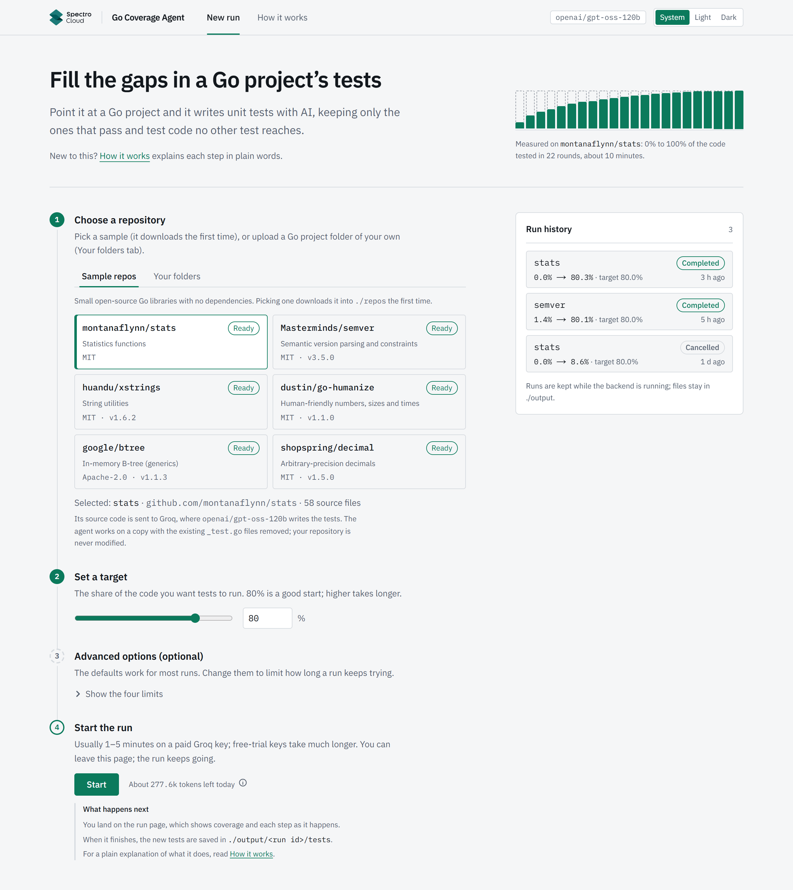</a>
<br><b>Setup page: numbered steps and Run history</b><br>The form as four numbered steps on a rail (1 Choose a repository and 2 Set a target show filled markers once done; 3 Advanced options is marked optional), each with a one-line hint. Step 1 holds the Sample repos tab with six cards (all six downloaded, so each shows Ready), <code>montanaflynn/stats</code> selected, the Selected summary (stats, <code>github.com/montanaflynn/stats</code>, 58 source files) with a short note under it (the code is sent to Groq, where <code>openai/gpt-oss-120b</code> writes the tests; the agent works on a copy and your repository is never modified), the closed Advanced options step, step 4 with the Start button, "About 1.6M tokens left today" and an ⓘ button beside it, and a short "What happens next" list (the run page, <code>./output/&lt;run id&gt;/tests</code>, How it works), and the Run history panel on the right: stats 0.0% to 80.3%, semver 1.4% to 80.1%, and a cancelled stats run at 8.6%.
</td>
<td valign="top">
<a href="docs/screenshots/gallery-runs-dark.png">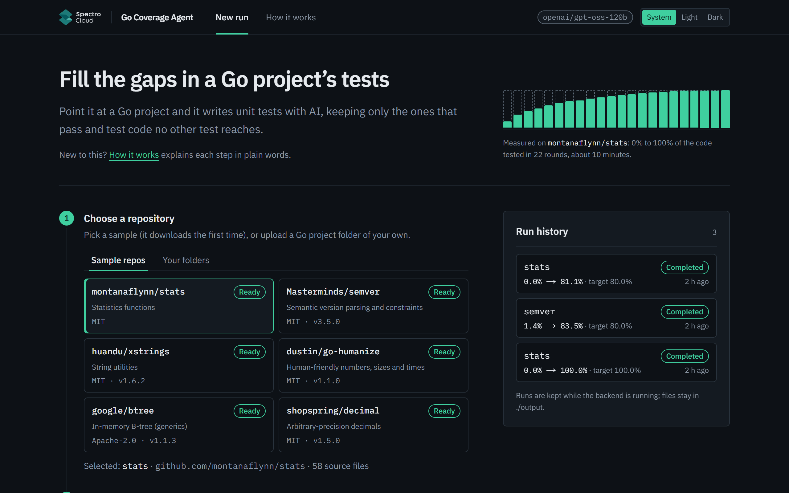</a>
<br><b>Dark theme</b><br>The same numbered setup steps and Run history panel in the dark theme.
</td>
</tr>
<tr>
<td valign="top">
<a href="docs/screenshots/gallery-job-nav.png">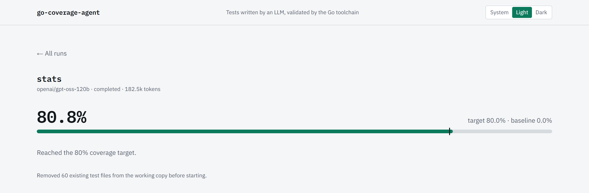</a>
<br><b>Job page</b><br>The navbar with New run, the "← All runs" link, the run header (stats, completed, 186.1k tokens) and the 80.3% coverage meter with its 80% target marker.
</td>
<td valign="top">
<a href="docs/screenshots/gallery-setup-mobile.png">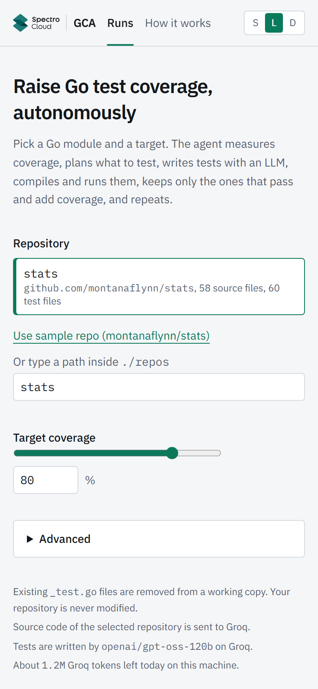</a>
<br><b>Setup page on mobile</b><br>The setup page at 390 px wide: the navbar collapses to a short title and S / L / D theme buttons, the numbered steps keep their rail, the sample cards stack in one column, the token budget line sits beside Start with "What happens next" under it, and Run history follows below.
</td>
</tr>
<tr>
<td valign="top">
<a href="docs/screenshots/gallery-howitworks.png">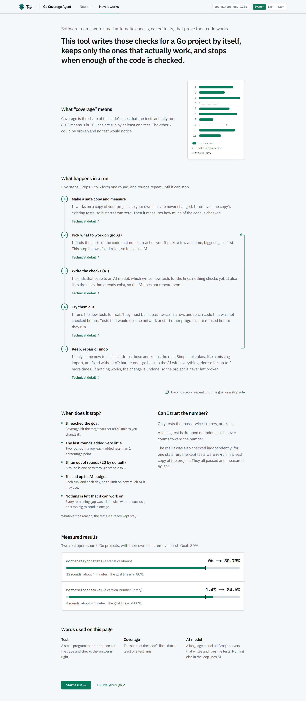</a>
<br><b>How it works page</b><br>A plain-language explanation for non-developers: what tests and coverage are (8 of 10 lines = 80%), the five steps of a run side by side (step 1 once at the start, steps 2 to 5 as one round with an arrow from step 5 back to step 2), each with a collapsed Technical detail, when it stops, why the number can be trusted, and measured results for <code>montanaflynn/stats</code> (0% to 80.75% in 12 rounds, about 4 minutes) and <code>Masterminds/semver</code> (1.4% to 84.6% in 4 rounds, about 2 minutes).
</td>
<td valign="top">
<a href="docs/screenshots/gallery-howitworks-mobile.png">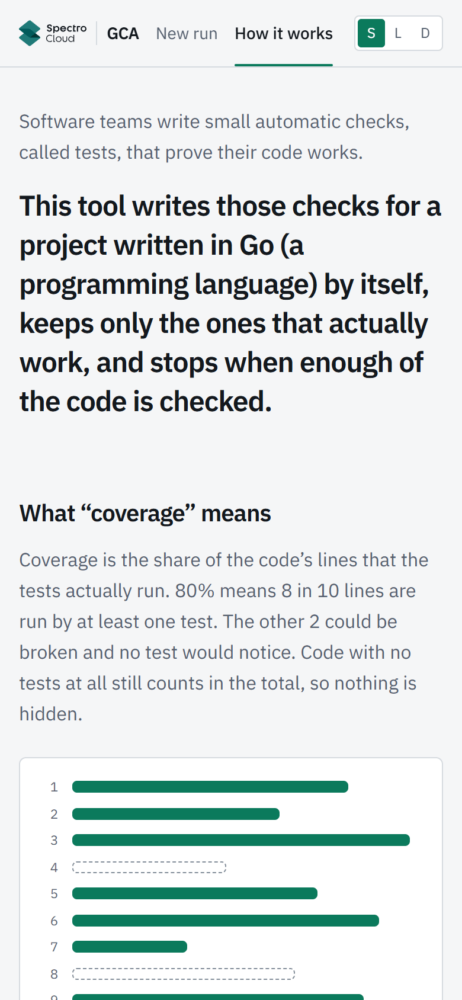</a>
<br><b>How it works on mobile</b><br>The same page at 390 px wide, with the steps stacked and the loop arrow beside them.
</td>
</tr>
<tr>
<td valign="top">
<a href="docs/screenshots/gallery-summary.png"></a>
<br><b>Run summary</b><br>Header, coverage meter with the 80% target marker, and the Target reached card: coverage 0.0% to 80.3%, 108 tests added in 29 test files, 4m 13s, 186.1k tokens.
</td>
<td valign="top">
<a href="docs/screenshots/gallery-folders.png">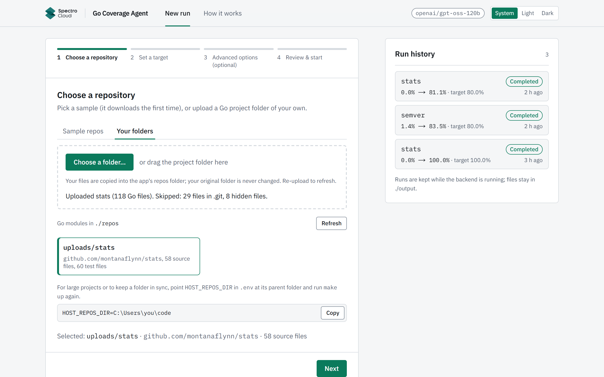</a>
<br><b>Your folders</b><br>The module found in the mounted folder (<code>C:\Users\you\code</code>), a Refresh button, and the "Add your own repository" note with a copyable <code>HOST_REPOS_DIR</code> line.
</td>
</tr>
<tr>
<td valign="top">
<a href="docs/screenshots/gallery-chart.png">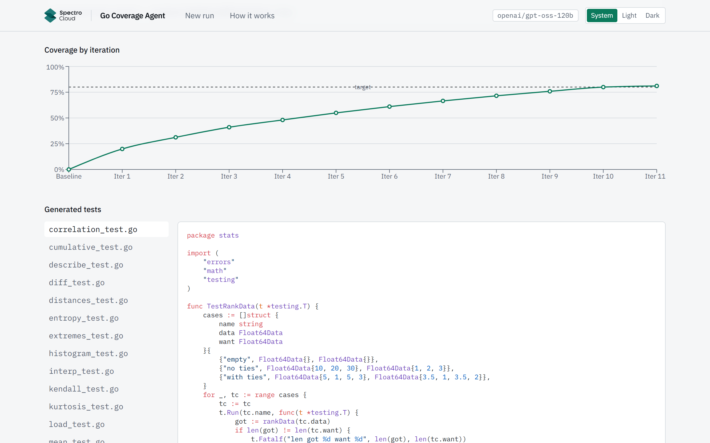</a>
<br><b>Coverage by iteration</b><br>Coverage after each of the 12 iterations, rising steadily from the 0% baseline to 80.3% and crossing the dashed 80% target line at iteration 12.
</td>
<td valign="top">
<a href="docs/screenshots/gallery-trace.png">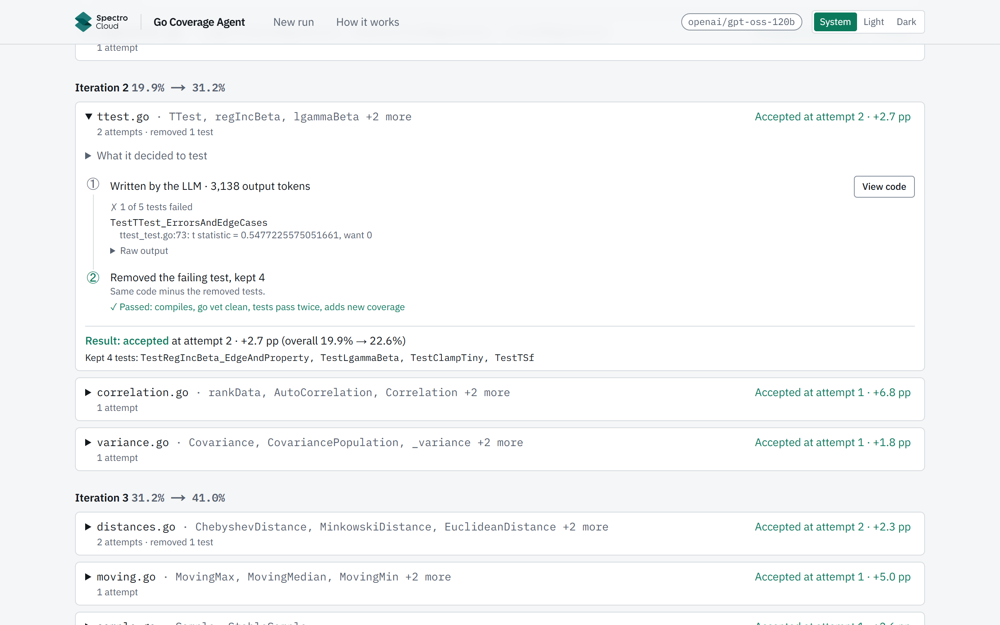</a>
<br><b>Attempt trace, expanded</b><br>Every attempt for <code>norm.go</code> in iteration 1, numbered: ① written by the LLM, didn't compile (<code>undefined: strconv</code>); ② auto-fixed with no LLM call, 3 of 8 tests failed, each listed once with its first message (raw output behind a toggle); ③ the 3 failing tests removed, 5 kept, passed. Result: accepted at attempt 3, +4.9 pp.
</td>
</tr>
<tr>
<td valign="top">
<a href="docs/screenshots/gallery-testfile.png">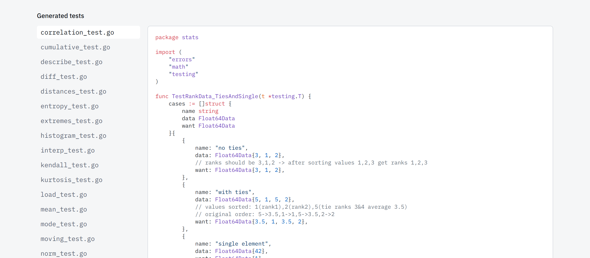</a>
<br><b>Generated tests</b><br>Every accepted test file is browsable with syntax-highlighted Go, here <code>correlation_test.go</code> (one of 29 files), so the output can be reviewed before use.
</td>
<td valign="top">
<a href="docs/screenshots/gallery-live.png">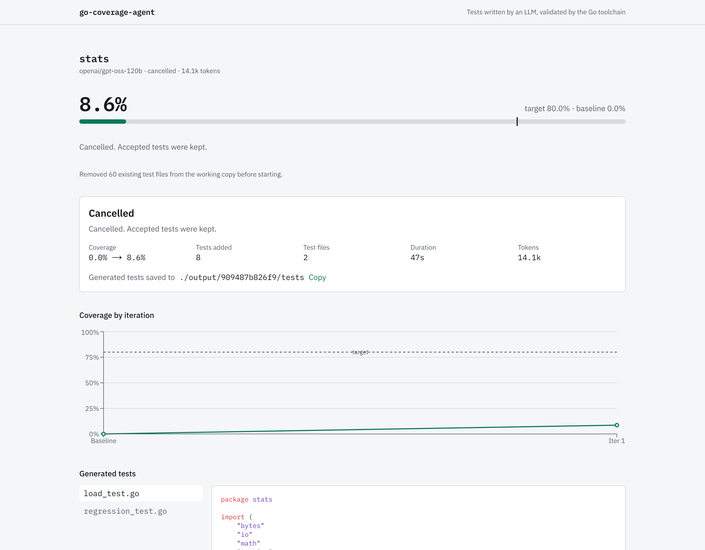</a>
<br><b>Run in progress</b><br>A run part-way through iteration 3: 31.5% against the 80% target, a Cancel button, the status line "Fixing compile error in moving.go (attempt 1)", and the Activity list with <code>moving.go</code> still Running.
</td>
</tr>
<tr>
<td valign="top">
<a href="docs/screenshots/gallery-dark.png">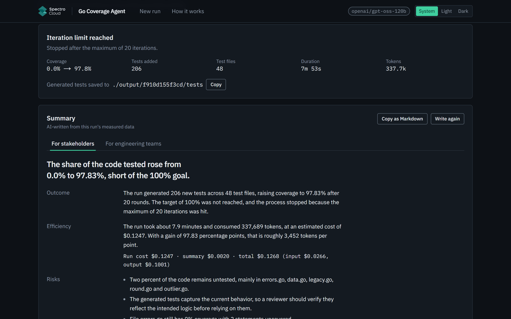</a>
<br><b>Dark theme</b><br>The job page header, meter, summary card and coverage chart in the dark theme.
</td>
<td valign="top">
<a href="docs/screenshots/gallery-mobile.png">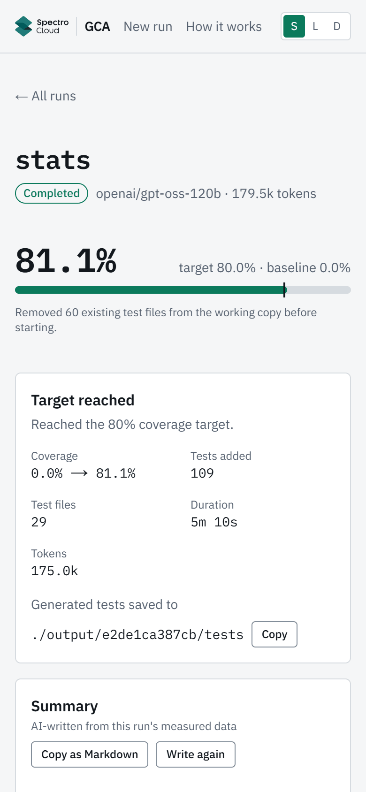</a>
<br><b>Mobile</b><br>The job page at 390 px wide: the summary card becomes two columns and the chart keeps every second iteration label.
</td>
</tr>
</table>

## Configuration

Options (`POST /api/jobs`). The UI's "Advanced" section exposes max iterations, min gain, files per iteration (`targets_per_iteration`) and fix attempts; the rest (`patience`, `delete_existing_tests`, `max_llm_tokens`, `exclude_patterns`) are API-only:

| Option | Default | Range |
|---|---|---|
| `target_coverage` | 80 | 1-100 |
| `max_iterations` | 20 | 1-30 |
| `min_gain` (percentage points per iteration) | 1.0 | 0-10 |
| `patience` | 2 | 1-5 |
| `targets_per_iteration` | 3 | 1-5 |
| `max_fix_attempts` | 2 | 0-4 |
| `delete_existing_tests` | true | bool |
| `max_llm_tokens` (per job) | 1,000,000 | 10K-2M |
| `exclude_patterns` (module-relative globs) | `["examples/**", "testdata/**"]` | list |

Environment variables (`.env`, same layout as `.env.example`). Only the key is required; everything else has a built-in default.

| Variable | Default | Meaning |
|---|---|---|
| **Required** | | |
| `GROQ_API_KEY` | (empty) | Needed to start a job |
| **Optional** | | |
| `GROQ_MODEL` | `openai/gpt-oss-120b` | `openai/gpt-oss-20b` is cheaper and weaker |
| `GROQ_WRITER_REASONING_EFFORT` | `medium` | Writer's reasoning effort (`medium` or `low`; `high` is accepted but too slow) |
| `GROQ_FIXER_REASONING_EFFORT` | `medium` | Fixer's reasoning effort (`medium` or `low`; `high` is accepted but too slow). If an answer is cut off for length, it is retried automatically one level lower |
| `BACKEND_PORT` / `FRONTEND_PORT` | 8000 / 3000 | Host ports (loopback only); run `make up` again after changing |
| `HOST_REPOS_DIR` | `./repos` | Host folder whose Go modules appear under "Your folders" |
| `DAILY_TOKEN_BUDGET` | 2,000,000 | The app's own daily token cap (not a Groq limit), counted in `output/.usage.json`, reset at midnight UTC. Raise it freely on a paid key |
| **Free-trial Groq key** (8K tokens/min, 200K/day): set all three | | |
| `DAILY_TOKEN_BUDGET` | | Free trial: `190000` |
| `MAX_PROMPT_TOKENS` | 12000 | Prompt-size cap per call. Free trial: `4500` |
| `CALL_TOKEN_RESERVATION` | 16000 | Tokens reserved per call for rate pacing. Free trial: `8000` |
| **Advanced** | | |
| `GROQ_MAX_COMPLETION_TOKENS` | 65536 | Output-token cap per call (the model maximum). Empty does not mean unlimited: Groq then applies a smaller default |
| `GROQ_TIMEOUT_S` | 240 | Seconds one Groq request may take. A timed-out request is retried once at `low` reasoning effort; a second timeout fails the item as "Groq timed out" |

## Running the tests

```bash
make test               # everything: Go helper, backend unit + integration (in Docker), frontend
make test-go
make test-backend
make test-integration
make test-frontend
```

CI (`.github/workflows/ci.yml`) runs exactly these make targets, so the Makefile is the single source of truth for the test commands.

Without `make` (Windows / Git Bash). Go is not required on the host; it runs in Docker:

```bash
export MSYS_NO_PATHCONV=1
# Go helper
docker run --rm -v "$PWD/tools/gohelper:/src" -w /src golang:1.27-bookworm go test ./...
# Backend image, then unit and integration tests inside it
docker build -f backend/Dockerfile --build-arg GO_IMAGE=golang:1.27-bookworm -t gca-backend .
docker run --rm gca-backend uv run --no-sync pytest
docker run --rm gca-backend uv run --no-sync pytest -m integration
# Frontend
cd frontend && npm ci && npm test
```

## Design decisions and trade-offs

- **Deterministic loop, LLM only for writing and fixing tests** (structured JSON output, no tool calls). Why: reliability, token cost, testability, safety. The LLM never gets a shell.
- **Append-only test generation** through a small Go AST helper. Accepted tests can't be lost, and failing tests are pruned one by one.
- **Strict acceptance:** a candidate is kept only if vet is clean, tests pass twice, and covered blocks strictly grow. Coverage never regresses.
- **The container is the only real isolation, and it is not a per-job sandbox.** The import/content guard is a best-effort filter, not a security boundary, and does not make generated code safe. Defense in depth: non-root, env allowlist (the API key is not passed to test processes, although code running as the same container user could still read it via `/proc`), best-effort import filter, timeouts with process-group kill, loopback-only ports. No Docker socket mount, because that would give the backend root-equivalent access to the host.
- **Token economy over generality:** a measured run showed that most Fixer calls were for mechanical errors (forgotten imports), so those are repaired without an LLM call, and the planner packs as many statements as fit into one prompt. See spec §6.7.
- **Groq only:** fast iterations; the cost is that reviewers need a key and rate limits shape run time on free keys. Output tokens are left uncapped by default (suited to a paid key).

## Limitations

- Expected values for floating-point code are partly characterization tests: when a generated assertion fails, the fixer may adopt the observed value if it's plausible. Real bugs may therefore be encoded rather than flagged; review generated assertions before trusting them.
- Generated tests run inside the backend container and could read files there (including the backend's environment via `/proc`) and start processes. The guard's rejection of `StartProcess` and `/proc/` is a cheap best-effort filter and is easy to bypass (string concatenation, reflection); it is not a sandbox. The real control for untrusted generated code is a per-job sandbox with a separate uid and no network (gVisor/Firecracker), listed as production future work.
- The repository's source code is sent to Groq.
- Jobs are in memory. Restarting the backend forgets the job list, but `./output` keeps all artifacts.
- Results depend on Groq rate limits and on the model; run time and final coverage vary between runs.

## AI usage

I used Claude Code as a pair programmer and implementation team. I set the direction and made the product and architecture decisions; Claude turned them into a detailed spec and plan and wrote the code. The assessment asks where AI was and wasn't used, so here is the split.

### What I decided before any detailed plan existed

- **Architecture.** Separate agents with a client/server split: a Next.js frontend and a FastAPI backend, run with Docker Compose. I chose FastAPI for the server side with production deployment in mind (run locally first, deploy to the cloud later).
- **LLM provider and model.** Groq, with `openai/gpt-oss-120b`.
- **The core idea.** An agent that plans, writes and executes unit tests and uses the execution results to decide what to do next. My first version gave the model terminal access; together we refined that into fixed, whitelisted Go commands and schema-checked JSON, so the model never gets a shell.
- **The process.** Spec first, then a task-by-task implementation plan, each reviewed repeatedly until the gaps were closed, then execution with an independent review of every task.

### Decisions I made during the build

- **Uncapped model output.** When Groq returned malformed JSON, I identified the output cap as the likely cause and had it removed.
- **The right API key.** I found that my first key was a free trial (8K tokens/min, 200K tokens/day), checked Groq's documentation, and switched to a Developer-plan key. That took the full run from a 28-minute partial result (69%) to 80.5% in under five minutes.
- **Token efficiency.** I chose to cut tokens per iteration, rather than adding a "continue a previous run" feature or relying on higher rate limits, so the tool stays usable on rate-limited keys. The data-driven changes that followed (a no-LLM repair step, larger targets per call) cut tokens per covered point by about 13%.
- **Cutting plan item size.** I saw `norm.go` stuck at 32.7% with model errors, traced it to plan items asking for answers too large to finish, and decided to cap items at 8 functions / 100 statements and split over-size answers. Later data from 366 targets (19 runs) showed that targets of 1 to 3 functions passed the first check 65% of the time, 4 to 5 functions 41%, and 6 to 8 functions 25%, so the cap is now 5 functions.
- **Proof that failing tests are not counted.** I asked for evidence, not an assurance. The final tests were re-run in a fresh clone and passed with 80.1%.
- **Fixing `make` for PowerShell.** `make test` failed on my machine, so I had the Makefile made shell-independent.
- **The UI gaps.** I found no theme switch, no way back to the start page, a one-line running banner, an unfinished navbar and no in-app explanation, and decided on the toggle, Run history panel, "← All runs", navbar and How it works page.
- **LLM quality over token savings.** I traced semver's `constraints.go` item, rejected after 6 attempts, asked why the LLM kept failing, and decided five changes: (1) give the Fixer the item's full attempt history, including the failures of tests that were pruned; (2) a Fixer rule to keep the tests that reached new lines and correct their expected values to the observed behaviour; (3) reasoning effort per role, with the old low-effort setting removed entirely; both roles now default to `medium`, because `high` was measured as too slow (a Fixer call was still waiting after ~114 s, against 9 s for a `medium` Writer call); (4) a Writer rule to trace parsing and regex logic step by step before asserting; (5) measuring the result on semver: 1.4% → 84.6% with nothing rejected, against 64.2% before the earlier fixes (see Results on Masterminds/semver).
- **Publishing and disclosure.** The wording of the per-file disclosure line and the pull-request workflow.

### What Claude did

- Proposed options and trade-offs at each decision point, and drafted the design spec and implementation plan from my direction. Each was reviewed by a separate AI reviewer and revised before I approved it.
- Wrote the code through subagents, one task at a time. A separate AI reviewer checked every task against the spec, with fix rounds until it passed.
- Ran the test suites and the live runs I approved, using the Groq keys I supplied. The numbers in [Results](#results-on-montanaflynnstats) come from those runs.

### What that means for the code

The code is AI-generated. I didn't hand-write it or review it line by line; I own the design, the decisions above, and the verified results. Every source file starts with a one-line comment saying how it was produced, and the full trail (spec, plan, measured runs) is in [`docs/superpowers/`](docs/superpowers/).
