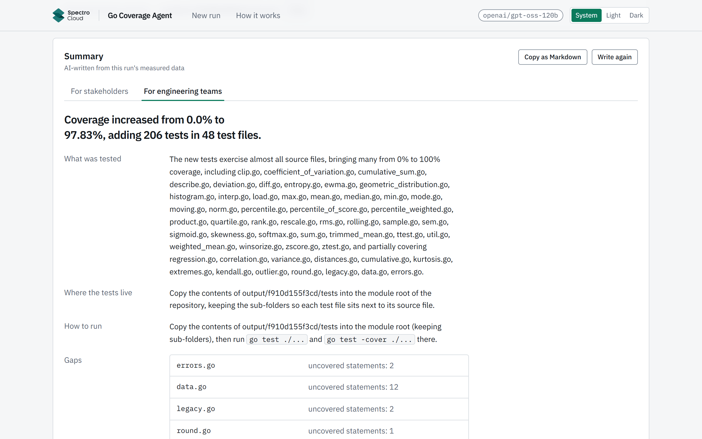

<!-- AI-generated with Claude Code from a human-approved spec and plan; each task independently AI-reviewed; integrated and verified by Lionel Derrick Roxas. -->
# go-coverage-agent

[](https://github.com/LionelRoxas/go-coverage-agent/actions/workflows/ci.yml)

An autonomous agent that raises unit-test coverage for Go repositories. Give it a local Go module and a target percentage. It measures coverage, plans what to test, asks an LLM to write idiomatic Go tests, compiles and runs them, keeps only the tests that pass and add coverage, and repeats until it hits the target or gains flatten out.

<a href="docs/screenshots/gallery-summary.png"></a>

## At a glance

- **Result on the assignment's repo** (montanaflynn/stats, its own tests deleted): **0% → 81.15% in 146 s** at the default 80% goal, and **0% → 100.0% in 332 s** at a 100% goal. Both runs were made with this code; `make verify-evidence` re-measures their tests in a plain Go container and gets the same numbers ([evidence](docs/evidence)). Test quality: the kept tests catch **72–75%** of planted bugs (mutation score).
- **How:** a deterministic loop does the planning, checking and stopping; the LLM only writes and fixes tests (strict JSON, no tools, no shell). A batch of tests is kept only if it compiles, passes `go vet`, every test asserts something, it passes twice and it covers code that wasn't covered before.
- **Stack:** FastAPI backend, Next.js frontend, a small Go AST helper, Docker Compose. **Model:** `openai/gpt-oss-120b` on Groq.
- **Scope:** a single-user tool that runs locally. There are no accounts: whoever opens http://localhost:3000 sees every run, and run history is saved in `./output`.

## Quick start

Requirements: Docker Desktop with Compose v2.24+. Node 22+ is needed only for `make test` / `make test-frontend`.

```bash
git clone https://github.com/LionelRoxas/go-coverage-agent.git && cd go-coverage-agent
# If you received a .env from me, put it in the repo root (it turns PARALLEL_WRITERS on, so runs are faster). Otherwise:
cp .env.example .env          # and paste your Groq key (https://console.groq.com/keys) into GROQ_API_KEY
make up                       # or: docker compose up --build
```

Open http://localhost:3000, click the **montanaflynn/stats** card under **Sample repos**, press **Next** to set a target (80% by default), **Skip (use defaults)** past the advanced options, then **Start**.

- **Timing:** on a paid (Developer-plan) key, a stats run to 80% takes about 2.5 minutes with parallel writers and about 5 without. A **free key** (8K tokens/min, 200K/day) works with the free-trial block in [`.env.example`](.env.example), but expect long rate-limit pauses and possibly less than 80% (an earlier free-key run reached 69% in 28 minutes).
- Without a key the stack still starts and the UI shows a "No Groq API key configured" banner.
- **Ports:** `BACKEND_PORT` / `FRONTEND_PORT` in `.env` (defaults 8000 / 3000); rebuild with `make up` after changing `BACKEND_PORT`.
- **Stopping:** both containers use `restart: unless-stopped`, so after `docker compose up -d` they stay up until `docker compose down` (Ctrl+C on `make up` stops them).
- **Linux:** the backend runs as uid 1000; make `./repos` and `./output` writable by uid 1000 if your uid differs. **Apple Silicon:** all images are multi-arch and the arm64 build succeeds; I have not run it on a Mac.

## Input: sample repos and your own code

**Sample repos** (the example data): six small, dependency-free Go libraries, cloned into `./repos/<id>` with one click: `montanaflynn/stats` (the assignment's repo), `Masterminds/semver`, `huandu/xstrings`, `dustin/go-humanize`, `google/btree` and `shopspring/decimal` (MIT or Apache-2.0).

**Your folders:**
- **Upload:** press **Choose a folder…** or drop the folder that contains `go.mod`. It is saved under `./repos/uploads/<name>`; `.git`, `vendor`, `node_modules`, hidden files, binaries and files over 1 MB are skipped (at most 3,000 files and 25 MB).
- **Host folder:** every Go module in `HOST_REPOS_DIR` (default `./my-repos`) is listed as `host/<path>`, mounted **read-only**. Copy a project into `./my-repos` and press Refresh, or point `HOST_REPOS_DIR` at an absolute path and run `make up`.

**Your code is never modified.** A run works on a copy in the container (`/work/<job-id>`, deleted afterwards), deletes the copy's existing `_test.go` files, and writes the generated tests to `./output/<job-id>/tests/` for you to review. Each run is saved as it goes, so a run that is stopped or crashes reloads as Interrupted with every test it had accepted.

## How it works

```
┌──────────────────────────── docker compose ────────────────────────────┐
│  ┌──────────────┐   HTTP + SSE    ┌──────────────────────────────────┐ │
│  │  frontend    │ ──────────────▶ │  backend (FastAPI)               │ │
│  │  Next.js     │ 127.0.0.1:8000  │  API ─▶ JobManager ─▶ Orchestrator │
│  │  :3000       │                 │      Planner    Writer/Fixer  Validator
│  └──────────────┘                 │   (deterministic)  (LLM)     (go tools)
│                                   │               LLM client   gohelper│
│                                   │                  Groq API   go test/vet/gofmt
│                                   │   Workspace: /work/<job>/repo (copy)│
│                                   └──────────────────────────────────┘ │
│  volumes: ./repos ─▶ /repos (samples, uploads)   ./output ─▶ /output   │
│           ${HOST_REPOS_DIR:-./my-repos} ─▶ /host-repos (read-only)     │
└────────────────────────────────────────────────────────────────────────┘
```

The loop is plain, testable Python; the LLM is used only to write tests, fix them and summarize the finished run. The app explains the loop in plain language at `/how-it-works` and in technical detail at `/walkthrough`.

1. **Measure.** Copy the repo, delete its `_test.go` files (default), and measure baseline coverage with `go test -coverprofile`.
2. **Plan.** A deterministic planner ranks files by uncovered statements and picks up to 3 targets per round, each up to 5 functions / 100 uncovered statements of one file (a file's biggest function is always included, even if it alone is larger). No tokens are spent on planning.
3. **Write.** The Writer LLM gets the target functions, with uncovered lines marked `// UNCOVERED`, and returns new tests as schema-checked JSON.
4. **Validate**, in this order:
   - a safety guard (denied imports such as `os/exec`, `net/*` and `crypto/tls`; no `func init` or `TestMain`; no `/proc/`, `environ`, root-path joins or absolute-path file writes);
   - a Go AST helper merges the tests into `<source>_test.go`;
   - compile, then `go vet`;
   - every new `Test` function must assert something (call `t.Error*`/`t.Fatal*`, or pass `t` to a helper);
   - `go test -count=2` passes;
   - the set of covered code blocks strictly grows, so coverage can never go down.
5. **Repair.** If some but not all new tests fail or don't assert, those are removed and the rest are checked again. Forgotten imports and reused test names are fixed without an LLM call. Anything else goes to the Fixer LLM with the item's full attempt history (up to 2 tries). A candidate that still fails is rolled back.
6. **Stop** on target reached, marginal gains (less than `min_gain` points for `patience` rounds), max rounds, no targets left, token budget, cancel, or Groq unreachable for 10 minutes. A Groq outage never counts against a target; the item is retried later.
7. **Summarize.** One more LLM call writes two summaries from the run's measured facts, one for stakeholders and one for engineers. A deterministic check drops any sentence whose numbers, files or test names aren't in those facts. Saved as `SUMMARY.md`; it can be turned off.
8. **Mutation test (optional).** On a finished run, **Run mutation test** swaps one operator at a time (`+`/`-`, `*`/`/`, `<`/`<=`, `>`/`>=`, `==`/`!=`, `&&`/`||`) in covered code of a fresh copy, for a seeded sample of up to 60 mutants, and reruns that package's tests. It shows the **mutation score** next to the coverage, per file, with each missed bug as a one-line diff. No LLM call for the test itself.
   - Score = caught ÷ (caught + missed): a planted bug is caught when a test fails or the test run times out, and missed when every test still passes. One that does not build is skipped and not counted.
   - Afterwards the AI summary is written again (as in step 7) with a *Test quality* paragraph, unless the summary is turned off or no Groq key or budget is left.

## Results

All on a Developer-plan Groq key, each repo's own tests deleted first.

| Repo | Run | Goal | Coverage | Mutation score | Time | Notes |
|---|---|---|---|---|---|---|
| montanaflynn/stats | `8c38d392ecaf` | 80% | 0% → **81.15%** | **71.7%** (43 of 60) | 146 s | Default options, parallel writers; 30 targets kept, 0 rejected; 205K tokens. [Re-measurable](docs/evidence) |
| montanaflynn/stats | `befcbd2b6ada` | 100% | 0% → **100.0%** | **75.0%** (45 of 60) | 332 s | 30 rounds max, 5 targets per round; 481K tokens. [Re-measurable](docs/evidence) |
| Masterminds/semver | `736baa413b5d` | 80% | 1.4% → **84.6%** | not run | 114 s | Starts at 1.4% because its `init()` functions run on load |

The mutation score is the share of planted bugs (a seeded sample of 60 operator swaps in covered code) that the kept tests catch. Most missed ones are in numerical code (`norm.go`, `ttest.go`) where tests check properties such as length or sign rather than exact values: coverage alone would not show that. The score is a lower bound, because each mutant runs only its own package's tests and a swap can leave behaviour unchanged.

Run times vary between runs and with the key's rate limits: an independent reviewer's run with the same settings took 345 s.

[docs/RESULTS.md](docs/RESULTS.md) has every other run, the comparisons behind the defaults (cap of 5 functions per target, reasoning effort, parallel writers, which roughly halved run time), and the issues I found in testing and fixed. Each comparison is a single run, so small differences are within normal variation.

## Screenshots

<table>
<tr><td valign="top" width="50%"><a href="docs/screenshots/gallery-setup.png"></a><br><b>New run, step 1:</b> the wizard beside Run history.</td><td valign="top" width="50%"><a href="docs/screenshots/gallery-trace.png"></a><br><b>Attempt trace:</b> guard rejection, LLM fix, prune, accepted.</td></tr>
<tr><td valign="top" width="50%"><a href="docs/screenshots/gallery-chart.png"></a><br><b>Coverage by round</b>, above the generated tests.</td><td valign="top" width="50%"><a href="docs/screenshots/gallery-summary-ai.png"></a><br><b>AI summary</b> for stakeholders.</td></tr>
</table>

<details>
<summary>More screenshots (dark theme, uploads, live run, test viewer, explainer pages, phone)</summary>

<table>
<tr><td valign="top" width="50%"><a href="docs/screenshots/gallery-runs-dark.png"></a><br><b>Review &amp; start</b>, dark theme.</td><td valign="top" width="50%"><a href="docs/screenshots/gallery-folders.png"></a><br><b>Your folders:</b> after uploading a local copy of stats.</td></tr>
<tr><td valign="top" width="50%"><a href="docs/screenshots/gallery-live.png"></a><br><b>Run in progress</b>, with Cancel and the Activity list.</td><td valign="top" width="50%"><a href="docs/screenshots/gallery-testfile.png"></a><br><b>Generated tests</b>, syntax-highlighted.</td></tr>
<tr><td valign="top" width="50%"><a href="docs/screenshots/gallery-dark.png"></a><br><b>Run page</b>, dark theme.</td><td valign="top" width="50%"><a href="docs/screenshots/gallery-summary-tech.png"></a><br><b>AI summary</b> for engineering teams.</td></tr>
<tr><td valign="top" width="50%"><a href="docs/screenshots/gallery-howitworks.png"></a><br><b>How it works</b>, in plain words.</td><td valign="top" width="50%"><a href="docs/screenshots/gallery-walkthrough.png"></a><br><b>Walkthrough</b>, the technical version.</td></tr>
<tr><td valign="top" width="50%"><a href="docs/screenshots/gallery-setup-mobile.png"></a><br><b>New run</b> on a phone.</td><td valign="top" width="50%"><a href="docs/screenshots/gallery-mobile.png"></a><br><b>Run page</b> on a phone.</td></tr>
<tr><td valign="top" width="50%"><a href="docs/screenshots/gallery-howitworks-mobile.png"></a><br><b>How it works</b> on a phone.</td><td></td></tr>
</table>

</details>

## Configuration

Job options (`POST /api/jobs`). The UI's advanced step exposes max iterations, min gain, files per iteration, fix attempts and the AI summary; the rest are API-only.

| Option | Default | Range |
|---|---|---|
| `target_coverage` | 80 | 1-100 |
| `max_iterations` | 20 | 1-30 |
| `min_gain` (percentage points per round) | 1.0 | 0-10 |
| `patience` | 2 | 1-5 |
| `targets_per_iteration` | 3 | 1-5 |
| `max_fix_attempts` | 2 | 0-4 |
| `delete_existing_tests` | true | bool |
| `max_llm_tokens` (per job) | 1,000,000 | 10K-2M |
| `exclude_patterns` (module-relative globs) | `["examples/**", "testdata/**"]` | list |
| `write_summary` (AI summary after the run) | true | bool |

Environment (`.env`; only the key is required). [`.env.example`](.env.example) documents every variable with its default.

| Variable | Default | Meaning |
|---|---|---|
| `GROQ_API_KEY` | (empty) | Needed to start a job |
| `GROQ_MODEL` | `openai/gpt-oss-120b` | `openai/gpt-oss-20b` is cheaper and weaker |
| `GROQ_WRITER_REASONING_EFFORT` / `GROQ_FIXER_REASONING_EFFORT` | `medium` / `medium` | `low` also works; `high` is accepted but too slow. An answer cut off for length is retried one level lower |
| `PARALLEL_WRITERS` | false | Send each round's writer requests at once; validation stays one at a time, in plan order. Faster on paid keys, no gain on free-trial keys (8K tokens/min). A round can spend tokens on answers that are never checked once the goal is reached mid-round |
| `BACKEND_PORT` / `FRONTEND_PORT` | 8000 / 3000 | Host ports (loopback only) |
| `HOST_REPOS_DIR` | `./my-repos` | Your Go projects, mounted read-only at `/host-repos` |
| `DAILY_TOKEN_BUDGET` | 2,000,000 | The app's own daily cap (not a Groq limit), counted in `output/.usage.json`, reset at midnight UTC |
| `GROQ_PRICE_INPUT_PER_M` / `GROQ_PRICE_OUTPUT_PER_M` | (unset) | USD per 1M tokens; when both are set the AI summary shows an estimated cost. `.env.example` sets 0.15 / 0.60 |
| Free-trial key: `DAILY_TOKEN_BUDGET` / `MAX_PROMPT_TOKENS` / `CALL_TOKEN_RESERVATION` | 2,000,000 / 12000 / 16000 | Set to 190000 / 4500 / 8000 |

Advanced settings (Groq timeout and output cap, outage window, per-stage Go timeouts, upload limits, history size, mutation test sample size and per-mutant timeout) are listed with their defaults in `.env.example`. `MIN_DAILY_TOKENS_TO_START` (20,000) and `MAX_OUTPUT_CHARS` (20,000 characters of command output kept) are also read, mainly for tests.

## Running the tests

```bash
make test              # Go helper, backend unit + integration (in Docker), frontend
make lint              # ruff (backend, in Docker), eslint + tsc --noEmit (frontend)
make verify-evidence   # re-measure docs/evidence on a fresh clone of montanaflynn/stats (needs network)
```

CI (`.github/workflows/ci.yml`) runs the test and lint targets and `make build-frontend`. Backend tests run in the image's `test` stage; the `runtime` stage that compose runs has no dev dependencies or tests. The integration tests run under the same container hardening as compose. Security scanning: CodeQL, Trivy (report-only) and Dependabot, with findings under the repository's Security tab.

<details>
<summary>Without <code>make</code> (Git Bash; Go runs in Docker)</summary>

```bash
export MSYS_NO_PATHCONV=1
docker run --rm -v "$PWD/tools/gohelper:/src" -w /src golang:1.27-bookworm sh -c "go vet ./... && go test ./..."
docker build -f backend/Dockerfile --build-arg GO_IMAGE=golang:1.27-bookworm --target test -t gca-backend-test .
docker run --rm gca-backend-test pytest
docker run --rm --cap-drop ALL --security-opt no-new-privileges:true --pids-limit 4096 --memory 4g --read-only \
  --tmpfs /tmp:exec,size=512m --tmpfs /work:exec,uid=1000,gid=1000,size=2g -v gca-it-gocache:/home/app/.cache \
  --env-file .env.example -v "$PWD/backend/tests/fixtures:/host-repos:ro" gca-backend-test pytest -m integration
docker volume rm gca-it-gocache
docker run --rm gca-backend-test ruff check --no-cache .
cd frontend && npm ci && npm test && npm run lint && npx tsc --noEmit
```

</details>

## Why Groq instead of a local model

Groq only was my decision; the brief allows a hosted LLM as well as LocalAI/Ollama. `openai/gpt-oss-120b` is an open-weight model (Ollama ships it as `gpt-oss:120b` and the smaller `gpt-oss:20b`), served fast on Groq: a stats run to 80% takes about 5 minutes. A run makes dozens of model calls, and I judged CPU-only inference of a model good enough for this loop far too slow for that; I did not measure it. The trade-off: you need a key (or the `.env` I send), and your code is sent to Groq (see [Limitations](#limitations)). What would change it is the first item on my [production list](#what-i-would-do-differently-in-production): an OpenAI-compatible base URL.

## Design decisions and trade-offs

- **Deterministic loop; the LLM only writes and fixes tests and writes the end-of-run summary** (structured JSON, no tool calls, no shell). Why: reliability, token cost, testability, safety.
- **Append-only test generation** through a small Go AST helper: accepted tests can't be lost, and the failing new tests are removed in one prune call. Pruning works on top-level `Test` functions, so passing subtests of a failing test go with it: simpler and safe, and each such failure is listed as a disagreement for review. Subtest-level pruning is the fix if those losses matter.
- **Strict acceptance:** vet clean, every new test asserts, tests pass twice, covered blocks strictly grow, so coverage never regresses. Mutation testing is an opt-in report after the run, on a sample of mutants, not an acceptance gate: running it on every candidate would multiply validation time. The coverage gain is judged per batch (one answer's tests, after any failing or assertion-free ones are pruned), not per test, so a single test in a kept batch may reach nothing the others do not.
- **Whole-module validation per candidate:** compile, vet and `go test -count=2` run over the whole module each time. At the size of these repos that is correct and simple; for a large module I would validate only the target's package and run a full check at the end of each round.
- **The planner optimises uncovered statements**, biggest gaps first, because that aims to reach the target with as few calls as possible. The cost: small files can stay at 0% at the target (18 stats files in `e2de1ca387cb`). If breadth mattered more than the number, I would add an option that writes one smoke test per exported function first.
- **Token economy:** mechanical errors (forgotten imports, reused names) are repaired without an LLM call, and the planner packs up to 5 functions / 100 uncovered statements of one file into each call (step 2 notes the one exception).
- **The model predicts expected values; the Go runtime decides.** I considered a "record mode" where the LLM only picks inputs and the system records the outputs as expected values. It would remove wrong-prediction failures, but every test would agree with the code by construction and could never catch a bug. So the prediction stays as a weak, independent oracle. When it disagrees with the code, the Fixer adopts the observed value unless that contradicts the function's documentation, in which case the case is dropped and reported as a suspected bug. Every such failure is listed as a *prediction disagreement* (in the trace, the run result and `SUMMARY.md`) with what became of it: a lead for a person, not a confirmed bug.
- **Scope.** The core loop is about 2,000 of the backend's 5,100 lines of Python, plus about 1,000 of support it relies on (workspace snapshots, models, attempt history, job setup). The rest is the API, run history, uploads and the AI summary. For a smaller v1 I would cut the AI summary, uploads and the host mount, parallel writers with the rate limiter's in-flight reservation and probe lock, and the walkthrough pages. The reservation and probe lock came in with parallel writers by design, not after an incident; in the default sequential mode, Groq's remaining-tokens header plus Retry-After would have been enough.
- **Defense in depth, not a sandbox:** the container hardening described under [Limitations](#limitations), an env allowlist (the key is not passed to test processes), a best-effort import guard, timeouts with process-group kill, loopback-only ports, no Docker socket mount.

## What I would do differently in production

- **LLM endpoint (first):** an OpenAI-compatible client with a configurable base URL, so a local model or a private deployment can replace Groq.
- **Per-run sandbox:** run each test in a throwaway container with `network: none` and no secrets, instead of the backend container plus a best-effort guard and an unprivileged user.
- **Auth and storage:** real authentication, then per-user runs in Postgres/Redis with ownership checks, instead of one user's history on disk.
- **Secrets** in a secret manager, not a `.env` file.
- **A job queue with workers** instead of one in-process job at a time.
- **Observability:** structured logs, metrics and traces instead of the event log alone.
- **Supply chain:** pinned image digests and dependency hashes, plus an SBOM.
- **Per-user rate limits and token budgets** instead of one app-wide daily budget.
- **Cheaper corrections:** patch simple mismatches (numbers, strings, booleans, error vs nil) from Go's own "got X, want Y" output without an LLM call, and keep the LLM fixer for suspicious cases (doc contradictions, NaN, panics).

## Limitations

- **What generated tests can't do:** modify your code (`HOST_REPOS_DIR` is mounted read-only) or the app (its code and Python environment are owned by root, and the root filesystem is read-only). Compose drops all capabilities, sets no-new-privileges, and limits the container to 4,096 tasks and 4 GB of memory.
- **What they still can do:** they run in the backend container as the same user (uid 1000) as the API server, so they could read `GROQ_API_KEY` via `/proc`, reach the network (outbound access is open), and write to the app's data folders: `./repos` and `./output` (so a test could plant a file in a sample repo or alter saved run history), `/work` and the Go build cache, which is shared by all runs. The import guard is easy to bypass (string concatenation, reflection). The real fix is the per-run sandbox listed under production; I would add it before running code from anyone I don't trust.
- **Resources:** `/work` (repo copies and Go's temp files) is a 2 GB in-memory filesystem; a module that fills it ends the run as `workspace_full` (raise the `/work` size and `mem_limit` together in `docker-compose.yml`). Running out of memory usually kills a single `go` process: that check fails and the run goes on.
- **Privacy:** the functions under test and related declarations (your source code) are sent to Groq in each prompt. The New run flow does not show this notice; the How it works and Walkthrough pages describe it.
- **Test quality:** expected values for floating-point code are partly characterization tests: the Fixer may adopt an observed value, so real bugs can be encoded rather than flagged. The rule against asserting a reported suspected bug is a prompt rule, not checked in code (an earlier 99.68% run asserted the `Float64Data.Midhinge` bug it reported; the two evidence runs lock in none of theirs). Review generated assertions before trusting them. The assertion check rejects tests that check nothing; assertion strength is measured only by the opt-in **Run mutation test** report, which samples mutants (60 by default) and never rejects tests.
- **Single-user by design:** no accounts, and history lives in `./output`.
- **Measurements:** run time and final coverage vary between runs and with the key's rate limits. The comparisons in [docs/RESULTS.md](docs/RESULTS.md) are single runs (n=1) at temperature 0.2; multi-seed runs are what I would add next. Most cited runs live in the gitignored `./output`; committed are the two evidence runs in [docs/evidence](docs/evidence) and the events and reports of `e2de1ca387cb` and `fc080d7fc500` as backend test fixtures.
- **Known simplifications:** a 429 whose Retry-After is over 90 s is treated as the daily budget being used up (the run stops), and prompt sizes are estimated as characters / 3.5, not with a tokenizer. Per-limit handling and a real tokenizer would come with a second provider.

## AI usage

I used Claude Code as a pair programmer and implementation team. I set the direction and made the product and architecture decisions; Claude turned them into a spec and plan and wrote the code.

### What I decided before any detailed plan existed

- **Architecture.** A Next.js frontend and a FastAPI backend with Docker Compose; FastAPI with a later cloud deployment in mind.
- **LLM provider and model.** Groq, with `openai/gpt-oss-120b`.
- **The core idea.** An agent that plans, writes and runs unit tests and uses the results to decide what to do next. My first version gave the model terminal access; together we refined that into fixed, whitelisted Go commands and schema-checked JSON.
- **The process.** Spec first, then a task-by-task plan, each reviewed until the gaps were closed, then execution with an independent review of every task.

### Decisions I made during the build

- **Uncapped model output.** When Groq returned malformed JSON, I identified the output cap as the likely cause and had it removed.
- **The right API key.** I found my first key was a free trial, checked Groq's documentation and switched to a Developer-plan key: from a 28-minute partial result (69%) to 80.5% in under five minutes.
- **Token efficiency.** I chose to cut tokens per round rather than add a "continue a previous run" feature; the changes that followed (a no-LLM repair step, larger targets per call) cut tokens per covered point by about 13%.
- **Smaller targets.** I saw `norm.go` stuck at 32.7% with model errors and had targets capped at 8 functions with over-size answers split. Later data showed targets of 1 to 3 functions passed the first check about twice as often as targets of 6 to 8, so I lowered the cap to 5 (see the [cap-of-5 table](docs/RESULTS.md#cap-of-5-functions-per-target)).
- **Proof that failing tests are not counted.** I asked for evidence, not an assurance: `ca1beb9a1fdb`'s tests all passed in a fresh clone, at 80.1%.
- **Fixing `make` for PowerShell**, and the **UI gaps** (theme toggle, Run history, "← All runs", How it works page).
- **LLM quality over token savings.** I traced semver's `constraints.go` item, asked why the Fixer kept failing, and decided five changes: (1) give the Fixer the item's full attempt history; (2) keep the tests that reached new lines and correct their expected values to the observed behaviour; (3) a reasoning effort per role, replacing the single `GROQ_REASONING_EFFORT` (then `low`), with both roles at `medium` because `high` was too slow; (4) a Writer rule to trace parsing logic before asserting; (5) measure it on semver: 64.2% before the earlier fixes, 84.6% after, nothing rejected.
- **Prediction over record mode** (see [Design decisions](#design-decisions-and-trade-offs)).
- **Disk-based run history** over a Redis/multi-user design, given the single-user scope.
- **Hosted model, no privacy notice in the New run flow** (see [Why Groq](#why-groq-instead-of-a-local-model) and [Limitations](#limitations)).
- **Publishing and disclosure.** The per-file disclosure wording and the pull-request workflow.
- **Independent review before submitting.** I had the finished app reviewed blind, from a technical and an AI-design point of view, and triaged the findings myself: I fixed the ones that mattered (container hardening, assertion-free tests, surfacing prediction disagreements, crash-safe run history, committed evidence) and documented the rest as trade-offs rather than growing the scope further.

### What Claude did

- Proposed options and trade-offs at each decision point, and drafted the spec and plan from my direction; each was reviewed by a separate AI reviewer and revised before I approved it.
- Wrote the code through subagents, one task at a time; a separate AI reviewer checked every task, with fix rounds until it passed.
- Ran the test suites and the live runs I approved, with the Groq keys I supplied.

### What that means for the code

The code is AI-generated, written by Claude Code under my direction. I decided the stack, approved the spec and plan, reviewed every task's review findings and fix rounds, made the product calls above, and verified the behaviour through the test suites and live runs. I own the design, the decisions and the results.

Every source and config file starts with a one-line comment saying how it was produced (`#`, `//` or `<!-- -->`): "AI-generated with Claude Code from a human-approved spec and plan; each task independently AI-reviewed; integrated and verified by Lionel Derrick Roxas." The LLM prompt files carry it as an HTML comment that is stripped before the prompt is sent. Exempt: files that can't hold a comment (`package.json`, `package-lock.json`, `uv.lock`, `.go-version`), the empty `.gitkeep` markers, the screenshots, the test fixtures in `backend/tests/fixtures/` (test data, some copied from real runs), and the spec and plan in [`docs/superpowers/`](docs/superpowers/), which Claude drafted as described above.
